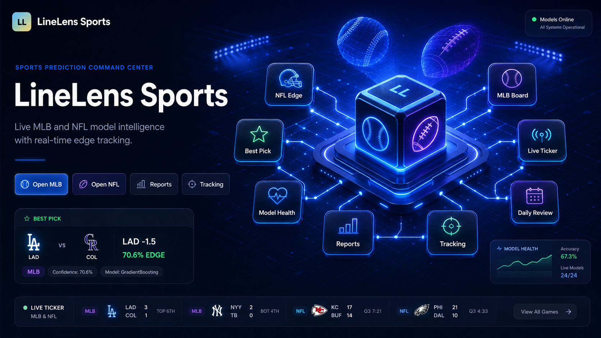
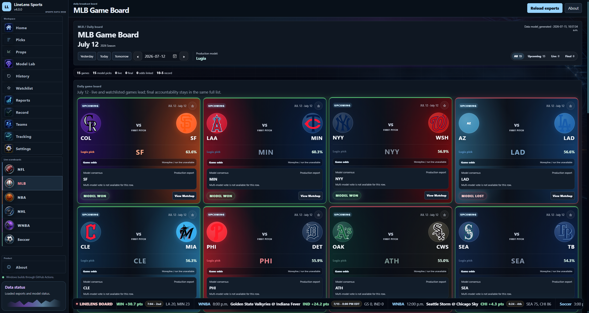

# LineLens Sports

LineLens Sports is a desktop sports-intelligence and model-evaluation app built around real bundled exports.

<p align="center">
  
</p>

<p align="center">
  
</p>


## Download (RECOMMENDED)

For Windows, download the latest `.msi` or `.exe` from the repository’s [Releases](https://github.com/VrajP0518/LineLens/releases) page.

## Run locally

Requires Python 3.11 and Node.js.

```powershell
git clone https://github.com/VrajP0518/LineLens.git
cd LineLens
py -3.11 -m venv .venv
.\.venv\Scripts\Activate.ps1
pip install -r requirements.txt
npm install
npm run app
```

The app uses bundled exports first, so the core pages can open without a live feed. Startup refreshes run in the background when the local refresh bridge is available.

## Optional odds

Copy `.env.example` to `.env` and add the provider key you use:

```text
ODDS_API_KEY=
SHARP_ODDS_API_KEY=
PROPLINE_API_KEY=
```

Refresh odds with:

```powershell
npm run refresh:odds
```

Missing odds remain unavailable; they are never inferred or fabricated.

## Main commands

```powershell
npm run refresh:live:fast
npm run refresh:mlb
npm run refresh:wnba
npm run refresh:props:pipeline
```

The props pipeline is optional and should only be run when the required real player data and model artifacts are available. MLB player-game data is stored locally as Parquet by the pybaseball collector.

## Features

- Home dashboard for quick access
- Picks: MLB and WNBA prediction feed
- Props: qualified and research-only player projections
- NFL / MLB / WNBA: sport-specific boards, date navigation, live scores, and model context
- GameCast: matchup detail, odds, timeline, and postgame review
- Models, Reports, Record: evaluation, health, and accountability
- Tracking ledger
- Personalized notifications
- Automatic Model Refreshing makes sure the model always trys to get better

## Data policy

LineLens shows real available data. Missing, stale, schedule-only, pending, and unavailable states are labelled. Predictions and market information are for educational analysis only and NOT BETTING ADVICE.

## Tech Stack

- Python
- JavaScript
- HTML
- CSS
- ML: scikit-learn, NumPy, pandas, joblib
- Data processing: Polars, PyArrow, pybaseball, nfl-data-py
- Desktop app: Tauri 2 with Rust
- Rust libraries: serde and tauri-plugin-opener
- Packaging/CI: Node.js/npm, GitHub Actions, Windows .msi/.exe builds
- Storage: bundled JSON/JavaScript exports, local Parquet files, and browser localStorage

## Project links

- [Source code](https://github.com/VrajP0518/LineLens)
- [Report an issue](https://github.com/VrajP0518/LineLens/issues)
- [Releases](https://github.com/VrajP0518/LineLens/releases)

Created by [Vraj Patel](https://github.com/VrajP0518).
