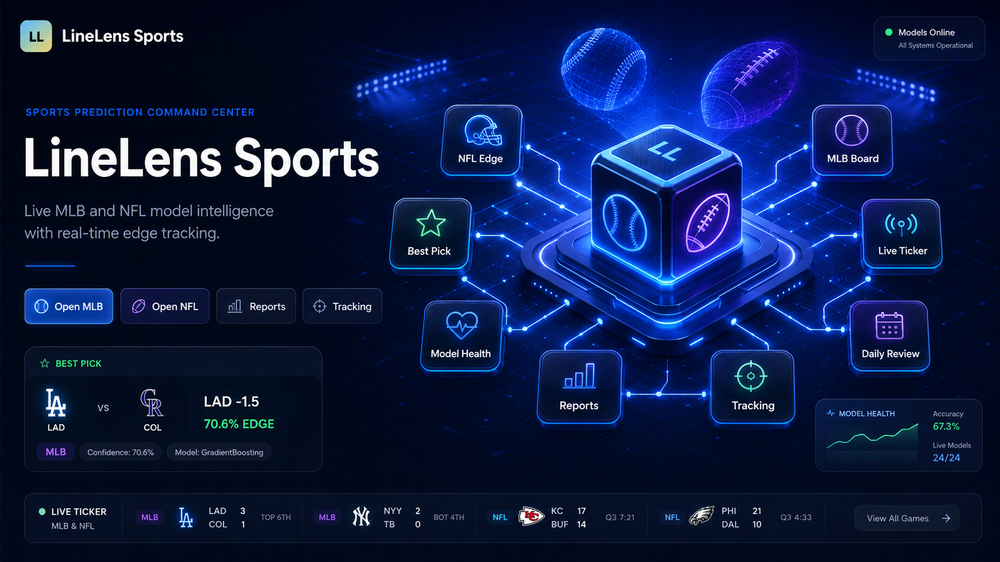
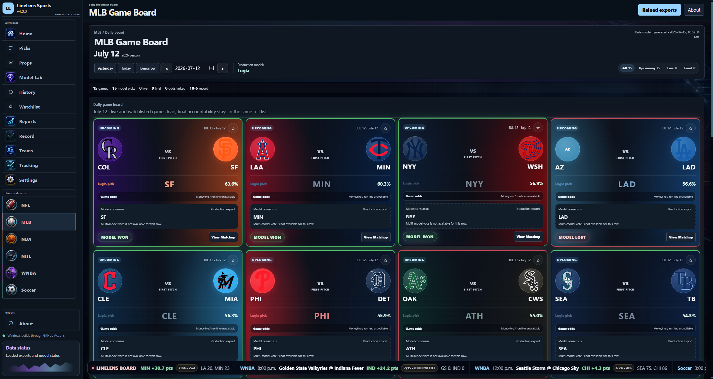
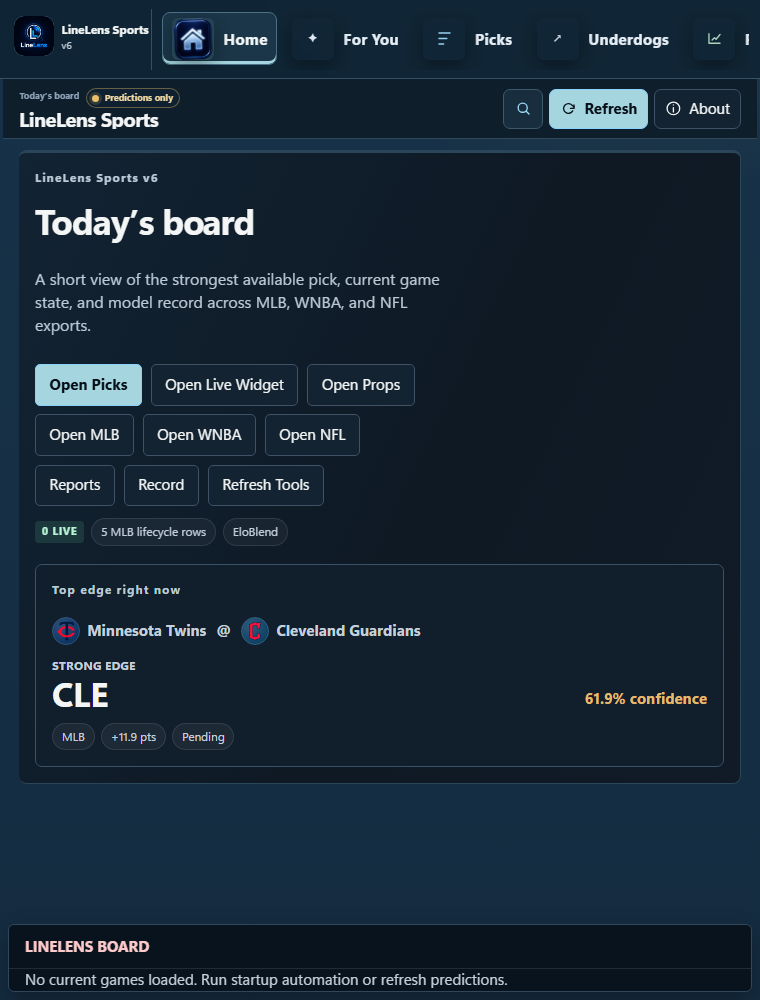
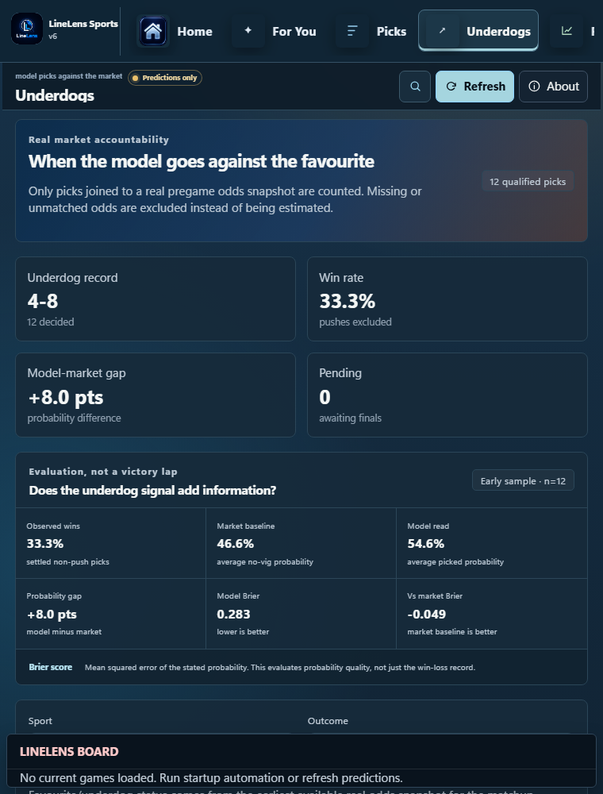

# LineLens Sports

LineLens Sports is a desktop sports-intelligence and model-evaluation app built around real bundled exports.

  

  

  
  

## Download

For Windows, download the latest `.msi` or `.exe` from the repository’s [Releases](https://github.com/VrajP0518/LineLens/releases) page.

## Features

- Home dashboard for quick access
- Picks: MLB and WNBA prediction feed
- Props: qualified and research-only player projections
- NFL / MLB / WNBA: sport-specific boards, date navigation, live scores, player-level box scores, and model context
- Underdogs: real-odds-qualified model picks with settled win/loss accountability
- GameCast: matchup detail, odds, timeline, and postgame review
- Models, Reports, Record: evaluation, health, and accountability
- Tracking ledger
- Personalized notifications
- Background refresh with cached-data fallback
- Settings release-readiness diagnostics and secret-safe support report
- MLB Economics: payroll-versus-wins regression, efficiency ranking, and team detail

## Data policy

LineLens shows real available data. Missing, stale, schedule-only, pending, and unavailable states are labelled. Predictions and market information are for educational analysis only and NOT BETTING ADVICE.

## Tech Stack

- Python
- JavaScript
- HTML
- CSS
- ML: scikit-learn, NumPy, pandas, joblib
- Data processing: Polars, PyArrow, pybaseball, nfl-data-py
- Desktop app: Tauri 2 with Rust
- Rust libraries: serde and tauri-plugin-opener
- Packaging/CI: Node.js/npm, GitHub Actions, Windows .msi/.exe builds
- Storage: bundled JSON/JavaScript exports, local Parquet files, and browser localStorage

## Project links

- [Source code](https://github.com/VrajP0518/LineLens)
- [Report an issue](https://github.com/VrajP0518/LineLens/issues)
- [Releases](https://github.com/VrajP0518/LineLens/releases)

Created by [Vraj Patel](https://github.com/VrajP0518).
